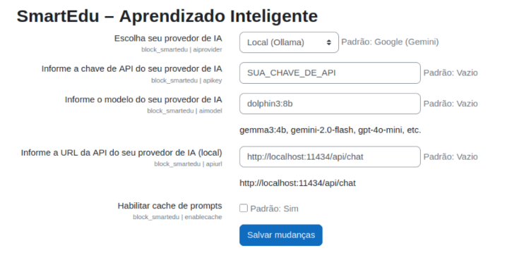
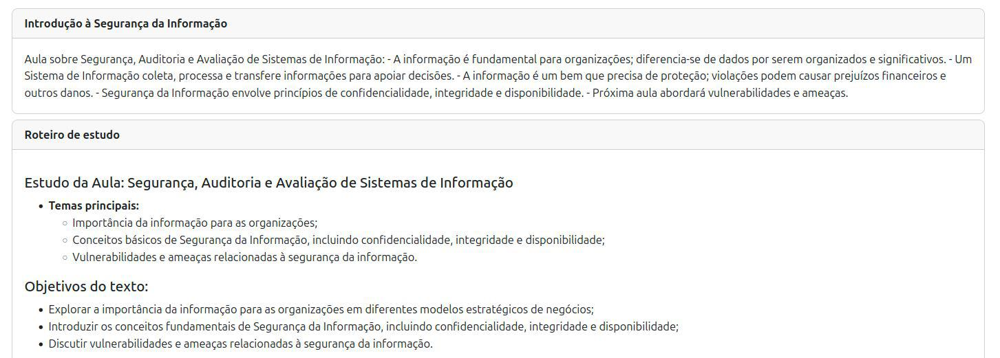
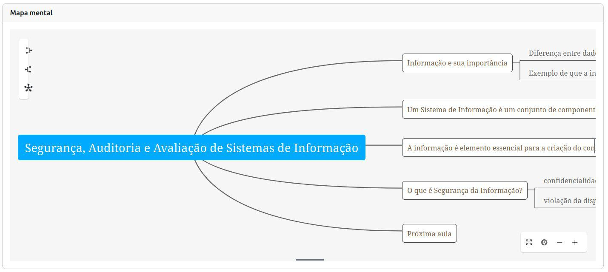
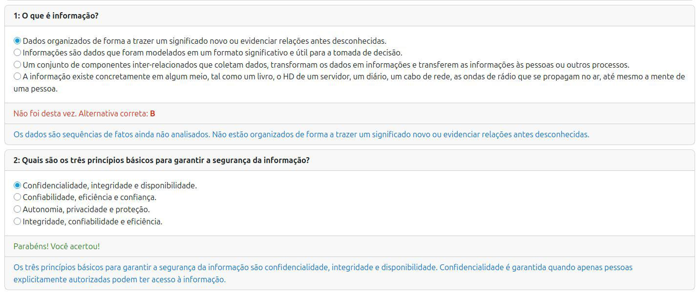
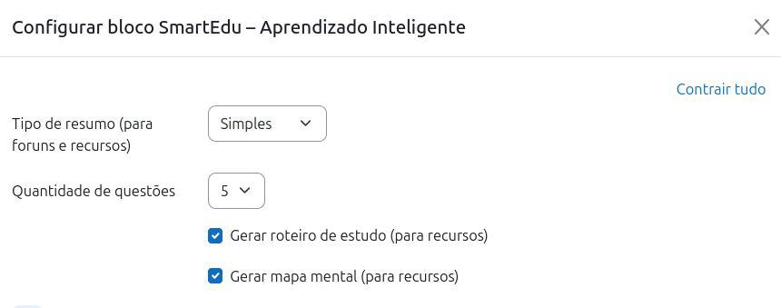
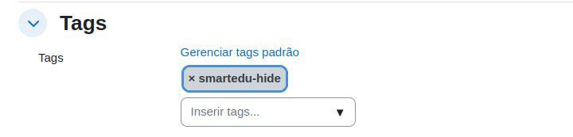

🌐 Linguagem: **🇧🇷 PT-BR** | [🇺🇸 EN](README.md)

SmartEdu (block_smartedu) 
====================

Plugin de bloco do Moodle LMS que aproveita o potencial da IA para aprimorar a educação.

## 📘 Documentação em Inglês (EN)

Para acessar a versão em inglês desta documentação, clique abaixo:

[➡️ Leia o README em Inglês](README.md)

## ✨ Features atuais

- Resume as anotações de aula fornecidas pelo professor em vários [formatos de arquivo](file-formats_pt-BR.md). Usuários podem ocultar itens do plugin usando a tag `smartedu-hide` nas configurações do recurso.

- Resume discussões de fórum.

- Gera resumos simples ou detalhados, conforme a preferência do usuário.

- Gera questionários, guias de estudo e mapas mentais a partir das anotações de aula.

- Atualmente, o plugin oferece suporte aos seguintes provedores de IA generativa: Google (Gemini), OpenAI (ChatGPT) e Local (Ollama).

## 📦 Requisitos

Moodle 3.9 ou superior.

## 🚀 Instalação

Basta instalar o plugin e adicionar o bloco a uma página do curso. 

## ⚙️ Configurações do Administrador

Após instalar o plugin, os administradores podem configurar a integração com provedores de IA generativa.  
Acesse: `Site administration > Plugins > Blocks > SmartEdu`

Você verá a seguinte página de configuração:

As configurações disponíveis são:

- **Escolha seu provedor de IA**  
  Selecione o provedor que será utilizado pelo plugin. As opções atualmente suportadas são **Google (Gemini)**, **OpenAI (ChatGPT)** e **Local (Ollama)**.  
  *Padrão:* Google (Gemini)

- **Insira a chave de API do seu provedor de IA**  
  Insira a chave de API obtida do provedor escolhido. Dependendo do provedor, pode ser necessário criar uma conta e adquirir um plano para obter uma chave válida (por exemplo, Google Gemini ou OpenAI).  
  *Padrão:* Vazio

- **Informe o modelo do seu provedor de IA**  
  Defina o modelo específico que deseja usar (por exemplo, `gemini-2.0-flash`, `gpt-4o-mini`, `gemma3:4b`).  
  *Padrão:* Vazio

- **Informe a URL da API do seu provedor de IA (local)**  
  Necessário apenas ao utilizar provedores de IA locais, como o Ollama. Exemplo:  
  `http://localhost:11434/api/chat`  
  *Padrão:* Vazio

- **Habilitar cache de prompts**  
  Quando ativado, o plugin armazena em cache prompts anteriores para melhorar o desempenho.

## 📚 Usando o Plugin

Os professores podem adicionar o bloco **SmartEdu** a qualquer curso pelo qual sejam responsáveis.  
Depois de adicionado, o bloco aparecerá na **lateral direita da página do curso**, conforme mostrado abaixo:

Neste exemplo, o bloco exibe os recursos do curso, como:

- **Discussão sobre o filme "Piratas do Vale do Silício"**  
  Um fórum de discussão criado dentro do curso. O SmartEdu pode resumir automaticamente as discussões, ajudando os alunos a capturar rapidamente os pontos principais.

Além de poder contar com recursos adicionais, como por exemplo:

- **Arquivo sobre matéria da aula (PDF)**  
  Um arquivo de notas de aula enviado pelo professor. O SmartEdu pode resumir esse documento e gerar materiais de estudo adicionais (resumos, guias de estudo, questionários ou mapas mentais).

Na parte inferior do bloco, uma mensagem lembra os usuários de que, ao utilizar o bloco SmartEdu, eles concordam com seus [termos de uso](terms-of-use_pt-BR.md). Isso garante transparência sobre como o plugin interage com os serviços de IA generativa e lida com o conteúdo educacional.

------------

### Exemplo: Resumos Automáticos e Guias de Estudo

Quando o professor envia as notas de aula, o SmartEdu pode gerar automaticamente **resumos** e **guias de estudo** para apoiar o aprendizado dos alunos.  

O exemplo abaixo mostra o conteúdo gerado a partir do recurso *Segurança da Informação – Parte 1*:

- A **Introdução** condensa as principais ideias das notas de aula em um formato claro e conciso.  
- O **Roteiro de Estudo** destaca:
  - **Tema principal** da aula;  
  - **Objetivos** para orientar o aprendizado do aluno;

Esses recursos ajudam os alunos a focar nos aspectos mais importantes do conteúdo e a se preparar de forma mais eficaz para discussões, questionários e provas.

------------

### Exemplo: Mapas Mentais Automáticos

Além de resumos e guias de estudo, o SmartEdu também pode gerar **mapas mentais interativos** a partir das notas de aula.  

Esses mapas mentais fornecem uma **representação visual** dos principais conceitos, ajudando os alunos a compreender rapidamente as relações entre ideias e navegar por tópicos complexos.

O exemplo abaixo foi gerado a partir do mesmo recurso *Segurança da Informação – Parte 1*:

- O **nó central** representa o tema principal da aula (*Segurança, Auditoria e Avaliação de Sistemas de Informação*).  
- Os **ramos** se expandem em conceitos relacionados, como Informação e sua impotância e O que é Segurança da Informação.
- Os alunos podem explorar o mapa de forma interativa, aplicando zoom e expandindo/recolhendo ramos para focar em detalhes específicos.  

Os mapas mentais são especialmente úteis para estudantes que se beneficiam de **recursos visuais de estudo** e para revisar o conteúdo de forma mais envolvente e memorável.

------------

### Exemplo: Questionários Interativos

Outro recurso importante do SmartEdu é a capacidade de gerar **questionários interativos** diretamente a partir das notas de aula.  

Esses questionários permitem que os alunos **pratiquem seus conhecimentos** respondendo a perguntas de múltipla escolha. Ao final, eles podem enviar suas respostas e receber feedback imediato.

O exemplo abaixo mostra um questionário gerado a partir da aula *Segurança da Informação*:

- Cada pergunta apresenta **quatro alternativas (A, B, C, D)**.  
- Após selecionar uma resposta, o aluno recebe **feedback instantâneo**:  
  - Se a resposta está correta ou incorreta.  
  - Uma breve explicação esclarecendo por que a opção escolhida está certa ou errada.  

Essa abordagem interativa ajuda os alunos a:  
- Reforçar o que foi aprendido em aula.  
- Identificar equívocos ou lacunas de conhecimento.  
- Aprender com os erros por meio das explicações fornecidas para cada alternativa.

------------

### Exemplo: Resumos de Fóruns

O SmartEdu também pode processar **discussões em fóruns** e gerar automaticamente resumos concisos dos principais pontos levantados pelos participantes.  

Isso é especialmente útil em cursos com discussões ativas, onde pode ser difícil para alunos e professores acompanharem todas as mensagens.

O exemplo abaixo mostra um resumo gerado a partir de um fórum sobre *Discussão sobre o filme*:

Ao condensar longas conversas em conclusões claras, o SmartEdu ajuda os alunos a focar nos **insights mais relevantes** da discussão, enquanto permite que os professores compreendam rapidamente a direção geral do debate.

## 🧑‍🏫 Configurações do Professor

Além das configurações do administrador, cada professor pode personalizar como o **bloco SmartEdu** se comporta em seu curso.  
Para isso, ele pode abrir o painel de configuração do bloco, conforme mostrado abaixo:

As opções disponíveis incluem:

- **Tipo de resumo**  
  Define como os resumos serão gerados. Os professores podem escolher entre:
  - *Simples*: Produz um resumo curto e conciso.  
  - *Detalhado*: Produz um resumo mais longo e abrangente.  

- **Quantidade de questões**  
  Define a quantidade de perguntas do questionário a serem geradas a partir do recurso selecionado.  
  Os professores também podem definir este valor como **0**, indicando que **nenhum questionário será gerado**.  

- **Gerar roteiro de estudo**  
  Quando ativado, o SmartEdu cria um **guia de estudo estruturado** junto com o resumo.  

- **Gerar mapa mental**  
  Quando ativado, o SmartEdu gera um **mapa mental interativo** a partir do recurso.   
  
------------

### Excluindo Recursos do Plugin

Em alguns casos, o professor pode adicionar recursos ao curso que **não devem ser processados pelo SmartEdu**.  
Exemplos incluem:  
- A descrição de uma atividade prática.  
- Um plano ou ementa do curso.  
- Qualquer documento que não contenha conteúdo didático.  

Por padrão, se o recurso estiver em um formato de arquivo compatível, o SmartEdu tentará processá-lo e disponibilizá-lo aos alunos. Para evitar isso, existe uma **tag especial** chamada: `smartedu-hide`

Quando essa tag é aplicada a um recurso, o plugin **ignora completamente** esse conteúdo, ou seja, ele não aparecerá no bloco SmartEdu para os alunos.

Isso oferece aos professores maior controle sobre quais recursos serão incluídos nos resumos, guias de estudo, questionários e mapas mentais do SmartEdu.

## 📌 Considerações

### Que tipo de IA generativa o plugin SmartEdu utiliza?

Atualmente, o plugin oferece suporte apenas a Gemini, ChatGPT e Local (Ollama).  

**Observação:** O plugin foi mais testado com o Google Gemini. Para provedores locais de IA (Ollama), ele funciona melhor com modelos do tipo *instruct*, que são otimizados para seguir instruções e gerar conteúdo educacional.

### Quais aspectos devem ser considerados ao usar o plugin?

Essas e outras questões estão abordadas nos [termos de uso](terms-of-use_pt-BR.md) do plugin.

## 📜 Licença

Licenciado sob a [Licença GNU GPL](LICENSE).
